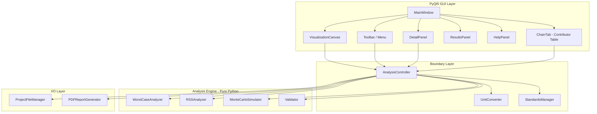

# Design Document: Tolerance Analysis Tool

## Overview

The Tolerance Analysis Tool is a standalone PyQt5 desktop application for mechanical tolerance stack-up analysis. It provides mechanical engineers and machinists with worst-case, RSS, and Monte Carlo analysis capabilities, stack-up visualization, and professional PDF report generation.

The architecture enforces strict separation between the pure Python analysis engine and the PyQt5 GUI layer. This enables:
- Independent testing of all mathematical logic without GUI dependencies
- Potential reuse of the engine in CLI or web contexts
- Clear interface contracts between modules

**Key Design Decisions:**
- Analysis engine is a zero-dependency pure Python package (only numpy for Monte Carlo)
- GUI communicates with engine via typed dataclass interfaces — no Qt types cross the boundary
- Project files use versioned JSON with a stable schema
- Unit system conversions happen at the boundary layer, engine works in raw numeric values
- PDF generation uses ReportLab for cross-platform consistency

## Architecture



### Layer Responsibilities

| Layer | Responsibility | Dependencies |
|-------|---------------|--------------|
| GUI | User interaction, display, event handling | PyQt5, Boundary |
| Boundary | Unit conversion, standards mapping, orchestration | Engine, I/O |
| Engine | Mathematical analysis, validation | numpy (Monte Carlo only) |
| I/O | File serialization, PDF generation | json, reportlab |

### Module Layout

```
tolerance_analysis/
├── __init__.py
├── main.py                     # Application entry point
├── engine/
│   ├── __init__.py
│   ├── models.py               # Core data models (dataclasses)
│   ├── worst_case.py           # Worst-case analyzer
│   ├── rss.py                  # RSS analyzer
│   ├── monte_carlo.py          # Monte Carlo simulator
│   ├── converter.py            # Tolerance type normalization
│   └── validator.py            # Input validation
├── boundary/
│   ├── __init__.py
│   ├── unit_converter.py       # Inch/mm conversion
│   ├── standards.py            # GD&T standards manager
│   └── controller.py           # Analysis orchestration
├── gui/
│   ├── __init__.py
│   ├── main_window.py          # MainWindow shell
│   ├── chain_tab.py            # Contributor table widget
│   ├── detail_panel.py         # Contributor detail card
│   ├── visualization.py        # Stack-up bar chart canvas
│   ├── results_panel.py        # Analysis results display
│   ├── help_panel.py           # Help content viewer
│   ├── theme.py                # Colors, fonts, stylesheet
│   └── dialogs.py              # Confirmation, error dialogs
├── io/
│   ├── __init__.py
│   ├── project_file.py         # JSON save/load
│   ├── schema.py               # Schema definition & migration
│   └── pdf_report.py           # PDF generation
└── resources/
    ├── help/                   # Markdown help content files
    └── icons/                  # Application icons
```

## Components and Interfaces

### Engine Layer

#### `engine.models` — Core Data Models

These are the shared data structures used across all layers. They are plain Python dataclasses with no framework dependencies.

```python
from dataclasses import dataclass, field
from enum import Enum
from typing import Optional

class ToleranceType(Enum):
    BILATERAL = "bilateral"
    UNILATERAL = "unilateral"
    LIMIT = "limit"

class Direction(Enum):
    POSITIVE = 1
    NEGATIVE = -1

class DistributionType(Enum):
    NORMAL = "normal"
    UNIFORM = "uniform"
    TRIANGULAR = "triangular"

@dataclass
class Contributor:
    name: str
    nominal: float
    direction: Direction
    tolerance_type: ToleranceType
    # For bilateral: upper_tol == lower_tol (symmetric ±)
    # For unilateral: upper_tol and lower_tol differ
    # For limit: upper_tol = upper_limit, lower_tol = lower_limit
    upper_tolerance: float
    lower_tolerance: float
    distribution: DistributionType = DistributionType.NORMAL
    description: str = ""
    notes: str = ""
    material: str = ""
    id: str = field(default_factory=lambda: str(uuid4()))

@dataclass
class BilateralForm:
    """Normalized form used internally by all analyzers."""
    nominal: float
    bilateral_tolerance: float  # Always positive, symmetric ±
    direction: Direction

@dataclass
class ToleranceChain:
    name: str
    description: str = ""
    contributors: list[Contributor] = field(default_factory=list)
    id: str = field(default_factory=lambda: str(uuid4()))

@dataclass
class WorstCaseResult:
    nominal: float
    total_tolerance: float
    maximum: float
    minimum: float
    tolerance_band: float

@dataclass
class RSSResult:
    nominal: float
    statistical_tolerance: float
    statistical_maximum: float
    statistical_minimum: float
    statistical_band: float
    worst_case: WorstCaseResult  # Always computed alongside for comparison

@dataclass
class MonteCarloResult:
    mean: float
    std_dev: float
    minimum: float
    maximum: float
    percentiles: dict[str, float]  # Keys: "0.135", "2.275", "50", "97.725", "99.865"
    histogram_data: list[float]    # Raw sample results for histogram rendering
    num_iterations: int
    bin_edges: list[float]
    bin_counts: list[int]
```

#### `engine.converter` — Tolerance Normalization

Converts all tolerance types to bilateral form for uniform analysis treatment.

```python
def to_bilateral(contributor: Contributor) -> BilateralForm:
    """
    Convert any tolerance type to equivalent bilateral form.
    
    Bilateral: nominal stays, tolerance = upper_tolerance
    Unilateral: shifted_nominal = nominal + (upper + lower) / 2
                bilateral_tol = (upper - lower) / 2
    Limit: nominal = (upper + lower) / 2
           bilateral_tol = (upper - lower) / 2
    """
```

#### `engine.worst_case` — Worst-Case Analyzer

```python
class WorstCaseAnalyzer:
    def analyze(self, chain: ToleranceChain) -> WorstCaseResult:
        """
        Compute worst-case stack-up.
        
        Algorithm:
        1. Convert each contributor to bilateral form
        2. total_nominal = Σ (bilateral.nominal × direction)
        3. total_tolerance = Σ |bilateral.tolerance|
        4. max = total_nominal + total_tolerance
        5. min = total_nominal - total_tolerance
        6. band = 2 × total_tolerance
        """
```

#### `engine.rss` — RSS Analyzer

```python
class RSSAnalyzer:
    def analyze(self, chain: ToleranceChain) -> RSSResult:
        """
        Compute RSS statistical stack-up.
        
        Algorithm:
        1. Convert each contributor to bilateral form
        2. total_nominal = Σ (bilateral.nominal × direction)
        3. rss_tolerance = √(Σ bilateral.tolerance²)
        4. stat_max = total_nominal + rss_tolerance
        5. stat_min = total_nominal - rss_tolerance
        6. stat_band = 2 × rss_tolerance
        
        Also computes worst-case for comparative display.
        """
```

#### `engine.monte_carlo` — Monte Carlo Simulator

```python
class MonteCarloSimulator:
    def simulate(
        self,
        chain: ToleranceChain,
        iterations: int = 10_000,
        seed: Optional[int] = None
    ) -> MonteCarloResult:
        """
        Run Monte Carlo simulation.
        
        Algorithm:
        1. For each iteration:
           a. For each contributor, sample from its distribution:
              - Normal: mean=nominal, std=tolerance/3 (3-sigma coverage)
              - Uniform: low=nominal-tolerance, high=nominal+tolerance
              - Triangular: low=nominal-tolerance, mode=nominal, 
                           high=nominal+tolerance
           b. assembly_dim = Σ (sample_i × direction_i)
        2. Compute statistics over all assembly results
        3. Build histogram with max(20, sqrt(iterations)) bins
        
        Uses numpy for vectorized sampling (performance).
        """
```

#### `engine.validator` — Input Validation

```python
class Validator:
    def validate_contributor(self, contributor: Contributor) -> list[str]:
        """Return list of error messages. Empty list = valid."""
    
    def validate_chain(self, chain: ToleranceChain) -> list[str]:
        """Validate chain-level constraints (name, min contributors)."""
    
    def validate_chain_name(self, name: str, existing_names: list[str]) -> list[str]:
        """Validate name length (1-100) and uniqueness."""
    
    def validate_numeric_input(self, value: str, field_name: str) -> tuple[bool, float | None, str]:
        """Parse and validate numeric input string."""
```

### Boundary Layer

#### `boundary.unit_converter` — Unit System Management

```python
class UnitSystem(Enum):
    INCH = "inch"
    MILLIMETER = "mm"

class UnitConverter:
    INCH_TO_MM = 25.4
    
    def convert(self, value: float, from_unit: UnitSystem, to_unit: UnitSystem) -> float:
        """Convert a single value between unit systems."""
    
    def convert_contributor(self, contributor: Contributor, to_unit: UnitSystem) -> Contributor:
        """Convert all dimensional values in a contributor."""
    
    def convert_chain(self, chain: ToleranceChain, to_unit: UnitSystem) -> ToleranceChain:
        """Convert all contributors in a chain."""
    
    def display_precision(self, unit: UnitSystem) -> int:
        """Return decimal places: 4 for inch, 3 for mm."""
    
    def format_value(self, value: float, unit: UnitSystem) -> str:
        """Format value with correct precision for display."""
```

#### `boundary.standards` — GD&T Standards Manager

```python
class StandardMode(Enum):
    ASME = "asme_y14_5"
    ISO = "iso_gps"
    GENERIC = "generic"

class StandardsManager:
    def get_symbols(self, mode: StandardMode) -> dict[str, str]:
        """Return tolerance symbol set for the active standard."""
    
    def get_report_label(self, mode: StandardMode) -> str:
        """Return standard identifier string for report headers."""
    
    def get_default_assumption(self, mode: StandardMode) -> str:
        """Return default geometric assumption text."""
```

#### `boundary.controller` — Analysis Orchestration

```python
class AnalysisController:
    """
    Central orchestrator between GUI and engine.
    Manages application state: current project, active chains, results.
    Handles unit conversion at the boundary.
    """
    
    def __init__(self):
        self.project: Project
        self.unit_system: UnitSystem
        self.standard_mode: StandardMode
        self.worst_case_analyzer: WorstCaseAnalyzer
        self.rss_analyzer: RSSAnalyzer
        self.monte_carlo: MonteCarloSimulator
        self.validator: Validator
        self.unit_converter: UnitConverter
    
    def run_worst_case(self, chain_id: str) -> WorstCaseResult | str:
        """Validate then analyze. Returns result or error message."""
    
    def run_rss(self, chain_id: str) -> RSSResult | str:
        """Validate then analyze. Returns result or error message."""
    
    def run_monte_carlo(self, chain_id: str, iterations: int) -> MonteCarloResult | str:
        """Validate then simulate. Returns result or error message."""
    
    def add_contributor(self, chain_id: str, contributor: Contributor) -> bool:
        """Validate and add contributor to chain."""
    
    def remove_contributor(self, chain_id: str, contributor_id: str) -> bool:
        """Remove contributor from chain."""
    
    def reorder_contributors(self, chain_id: str, new_order: list[str]) -> None:
        """Reorder contributors by ID list."""
    
    def change_unit_system(self, new_unit: UnitSystem) -> None:
        """Convert all dimensional data to new unit system."""
    
    def save_project(self, filepath: str) -> str | None:
        """Save project. Returns error message or None on success."""
    
    def load_project(self, filepath: str) -> str | None:
        """Load project. Returns error message or None on success."""
    
    def export_pdf(self, filepath: str) -> str | None:
        """Export PDF report. Returns error message or None on success."""
```

### I/O Layer

#### `io.project_file` — JSON Serialization

```python
class ProjectFileManager:
    SCHEMA_VERSION = "1.0.0"
    
    def save(self, project: Project, filepath: str) -> None:
        """Serialize project to JSON with 2-space indent, 6+ significant digits."""
    
    def load(self, filepath: str) -> Project:
        """
        Deserialize project from JSON.
        Raises ProjectFileError with field/line info on failure.
        """
    
    def validate_schema(self, data: dict) -> list[str]:
        """Check required fields and types. Return error list."""
```

#### `io.pdf_report` — PDF Generation

```python
class PDFReportGenerator:
    """
    Generates professional PDF reports using ReportLab.
    
    Design decisions:
    - Uses ReportLab Platypus for high-level layout (tables, paragraphs)
    - Visualization rendered as matplotlib figure -> PNG -> embedded in PDF
    - Supports up to 50 contributors in the data table
    - Header includes project name, date, standard mode, unit system
    """
    
    def generate(
        self,
        project: Project,
        chain: ToleranceChain,
        results: AnalysisResults,
        filepath: str,
        standard_mode: StandardMode,
        unit_system: UnitSystem
    ) -> None:
        """Generate complete PDF report."""
```

### GUI Layer

#### `gui.visualization` — Stack-Up Bar Chart

```python
class VisualizationCanvas(QWidget):
    """
    Custom-painted horizontal stacking bar chart.
    
    Design:
    - Dark canvas background (HSL L <= 20%)
    - Each contributor is a bar segment, width proportional to nominal
    - Tolerance zones as translucent overlays (30% opacity)
    - Blue/cyan for positive direction, orange/amber for negative
    - Green/red result bar for in-spec/out-of-spec
    - Purple Monte Carlo distribution overlay
    - Updates within 500ms of data change via signal/slot
    
    Uses QPainter for rendering (no matplotlib dependency in GUI).
    """
    
    def set_chain(self, chain: ToleranceChain, results: Optional[AnalysisResults]) -> None:
        """Update visualization data and trigger repaint."""
    
    def paintEvent(self, event: QPaintEvent) -> None:
        """Custom paint: bars, tolerance bands, result indicators."""
```

#### `gui.theme` — Application Theme

```python
COLORS = {
    # Canvas
    "canvas_bg": "#1a1a2e",          # Dark workspace (L ~11%)
    
    # UI Shell
    "ui_bg": "#f0f0f5",              # Light shell (L ~95%)
    "ui_surface": "#e8e8ed",         # Card surfaces (L ~91%)
    "ui_border": "#c8c8d0",          # Borders
    
    # Semantic colors
    "positive": "#4fc3f7",           # Blue/cyan - positive direction
    "negative": "#ffb74d",           # Orange/amber - negative direction
    "in_spec": "#66bb6a",            # Green - within tolerance
    "out_spec": "#ef5350",           # Red - outside tolerance
    "monte_carlo": "#ab47bc",        # Purple - MC overlay
    
    # Text
    "text_primary": "#212121",
    "text_secondary": "#616161",
    "text_on_dark": "#e0e0e0",
}

FONTS = {
    "ui": "Inter",
    "mono": "JetBrains Mono",
    "fallback_ui": "Segoe UI, Helvetica, Arial, sans-serif",
    "fallback_mono": "Consolas, Courier New, monospace",
}
```

## Data Models

### Project File Schema (JSON)

```json
{
  "schema_version": "1.0.0",
  "unit_system": "inch",
  "standard_mode": "generic",
  "project_name": "Assembly Stack-Up",
  "created": "2024-01-15T10:30:00Z",
  "modified": "2024-01-15T14:22:00Z",
  "tolerance_chains": [
    {
      "id": "uuid-string",
      "name": "Main Bearing Stack",
      "description": "Axial stack through bearing housing",
      "contributors": [
        {
          "id": "uuid-string",
          "name": "Housing bore depth",
          "nominal": 1.5000,
          "tolerance_type": "bilateral",
          "upper_tolerance": 0.002,
          "lower_tolerance": 0.002,
          "direction": "positive",
          "distribution": "normal",
          "description": "Machined bore",
          "notes": "CNC turned, Cpk 1.33",
          "material": "6061-T6 Aluminum"
        }
      ],
      "analysis_settings": {
        "monte_carlo_iterations": 10000
      },
      "results": {
        "worst_case": { ... },
        "rss": { ... },
        "monte_carlo": { ... }
      }
    }
  ]
}
```

### Internal State Model

```python
@dataclass
class Project:
    name: str
    filepath: Optional[str] = None
    unit_system: UnitSystem = UnitSystem.INCH
    standard_mode: StandardMode = StandardMode.GENERIC
    tolerance_chains: list[ToleranceChain] = field(default_factory=list)
    created: datetime = field(default_factory=datetime.now)
    modified: datetime = field(default_factory=datetime.now)

@dataclass
class AnalysisResults:
    worst_case: Optional[WorstCaseResult] = None
    rss: Optional[RSSResult] = None
    monte_carlo: Optional[MonteCarloResult] = None
```

## Key Algorithms

### Tolerance Normalization (Bilateral Conversion)

All analysis methods require contributors in bilateral form. The conversion logic:

```
Given contributor with tolerance_type:

BILATERAL (±T):
  bilateral_nominal = nominal
  bilateral_tolerance = upper_tolerance  (upper == lower for symmetric)

UNILATERAL (+U / -L):
  shift = (upper_tolerance + lower_tolerance) / 2  
  Note: lower_tolerance stored as negative for -L deviations
  bilateral_nominal = nominal + shift
  bilateral_tolerance = (upper_tolerance - lower_tolerance) / 2

LIMIT (Upper_Limit / Lower_Limit):
  bilateral_nominal = (upper_tolerance + lower_tolerance) / 2
  bilateral_tolerance = (upper_tolerance - lower_tolerance) / 2
```

For unilateral example: +0.000/-0.005 → upper=0.000, lower=-0.005
- shift = (0.000 + (-0.005)) / 2 = -0.0025
- bilateral_nominal = nominal - 0.0025
- bilateral_tolerance = (0.000 - (-0.005)) / 2 = 0.0025

### Worst-Case Algorithm

```
Input: ToleranceChain with N contributors
Output: WorstCaseResult

1. For each contributor i (i = 1..N):
   bilateral_i = to_bilateral(contributor_i)

2. total_nominal = Σ (bilateral_i.nominal × bilateral_i.direction.value)

3. total_tolerance = Σ |bilateral_i.bilateral_tolerance|

4. maximum = total_nominal + total_tolerance
5. minimum = total_nominal - total_tolerance
6. tolerance_band = 2 × total_tolerance

Return WorstCaseResult(nominal, total_tolerance, maximum, minimum, tolerance_band)
```

### RSS Algorithm

```
Input: ToleranceChain with N contributors
Output: RSSResult (includes worst-case for comparison)

1. For each contributor i (i = 1..N):
   bilateral_i = to_bilateral(contributor_i)

2. total_nominal = Σ (bilateral_i.nominal × bilateral_i.direction.value)

3. rss_tolerance = √(Σ (bilateral_i.bilateral_tolerance)²)

4. statistical_maximum = total_nominal + rss_tolerance
5. statistical_minimum = total_nominal - rss_tolerance
6. statistical_band = 2 × rss_tolerance

7. worst_case = WorstCaseAnalyzer.analyze(chain)  # For comparison

Return RSSResult(nominal, rss_tolerance, stat_max, stat_min, stat_band, worst_case)
```

### Monte Carlo Algorithm

```
Input: ToleranceChain, iterations (default 10,000)
Output: MonteCarloResult

1. Initialize results array of size [iterations]

2. For each contributor i:
   bilateral_i = to_bilateral(contributor_i)
   Generate [iterations] samples based on distribution type:
   
   NORMAL:
     samples = numpy.random.normal(
       mean=bilateral_i.nominal,
       std=bilateral_i.bilateral_tolerance / 3,  # ±3σ = tolerance
       size=iterations
     )
   
   UNIFORM:
     samples = numpy.random.uniform(
       low=bilateral_i.nominal - bilateral_i.bilateral_tolerance,
       high=bilateral_i.nominal + bilateral_i.bilateral_tolerance,
       size=iterations
     )
   
   TRIANGULAR:
     samples = numpy.random.triangular(
       left=bilateral_i.nominal - bilateral_i.bilateral_tolerance,
       mode=bilateral_i.nominal,
       right=bilateral_i.nominal + bilateral_i.bilateral_tolerance,
       size=iterations
     )
   
   results += samples × direction_i.value

3. Compute statistics:
   mean = numpy.mean(results)
   std_dev = numpy.std(results)
   minimum = numpy.min(results)
   maximum = numpy.max(results)
   percentiles = numpy.percentile(results, [0.135, 2.275, 50, 97.725, 99.865])

4. Build histogram:
   num_bins = max(20, int(sqrt(iterations)))
   bin_counts, bin_edges = numpy.histogram(results, bins=num_bins)

Return MonteCarloResult(mean, std_dev, min, max, percentiles, results, iterations, bin_edges, bin_counts)
```

## Visualization Approach

The stack-up visualization uses QPainter custom rendering on a QWidget canvas. This avoids matplotlib dependency in the GUI layer and provides responsive < 500ms updates.

### Rendering Pipeline

1. **Layout calculation**: Determine scale factor from total nominal span to canvas width
2. **Bar segments**: Draw filled rectangles for each contributor, width = nominal × scale
3. **Tolerance bands**: Draw semi-transparent rectangles overlaid on each bar (30% opacity)
4. **Direction coloring**: Apply blue/cyan or orange/amber based on contributor direction
5. **Result indicator**: Draw total result bar below the stack (green/red based on spec)
6. **Monte Carlo overlay**: If results exist, draw histogram/density curve in purple above result bar
7. **Labels**: Contributor names, dimensional values in active unit system

### Color Mapping

| Element | Color | Opacity |
|---------|-------|---------|
| Positive contributor bar | #4fc3f7 (cyan) | 100% |
| Negative contributor bar | #ffb74d (amber) | 100% |
| Tolerance band | Same as bar | 30% |
| In-spec result | #66bb6a (green) | 100% |
| Out-of-spec result | #ef5350 (red) | 100% |
| Monte Carlo distribution | #ab47bc (purple) | 60% |
| Canvas background | #1a1a2e | 100% |

## Error Handling

### Validation Errors (User Input)

- Non-numeric input in numeric fields: Field border turns red, tooltip shows error, previous valid value retained
- Negative tolerance values: Rejected with inline error message
- Empty chain name or duplicate name: Creation prevented, error dialog displayed
- Insufficient contributors for analysis: Analysis buttons disabled, info message shown

### File I/O Errors

- JSON parse failure: Error dialog showing field/line, current project state preserved
- Unrecognized schema version: Non-blocking warning with version info, attempt load anyway
- File system write failure: Error dialog with cause, previous file preserved (write to temp first, then rename)
- File too large (>50 MB load): Performance warning but attempt proceeds

### Analysis Errors

- Chain with < 2 contributors (worst-case/RSS): Error message, no calculation
- Chain with 0 contributors (Monte Carlo): Error message, no simulation
- Numerical overflow: Caught and reported as "result exceeds displayable range"

### Strategy: Write-Ahead for File Safety

Save operations use a write-ahead pattern:
1. Serialize to memory
2. Write to `{filepath}.tmp`
3. Verify temp file is valid JSON
4. Atomic rename: `{filepath}.tmp` → `{filepath}`
5. On failure at any step, original file is untouched


## Correctness Properties

*A property is a characteristic or behavior that should hold true across all valid executions of a system - essentially, a formal statement about what the system should do. Properties serve as the bridge between human-readable specifications and machine-verifiable correctness guarantees.*

### Property 1: Tolerance Normalization Round-Trip Consistency

*For any* contributor with any tolerance type (bilateral, unilateral, or limit), converting to bilateral form and then computing the tolerance range (nominal +/- bilateral_tolerance) SHALL produce the same effective dimensional range as the original specification. Specifically:
- For bilateral +/-T: range = [nominal - T, nominal + T]
- For unilateral +U/-L: range = [nominal + L, nominal + U] (where L is negative)
- For limit [Lower, Upper]: range = [Lower, Upper]

The bilateral conversion SHALL preserve this range exactly.

**Validates: Requirements 2.4, 2.5, 3.4**

### Property 2: Worst-Case Analysis Correctness

*For any* tolerance chain with 2 or more contributors (each with arbitrary valid nominal, tolerance, direction, and tolerance type), the worst-case analysis SHALL produce:
- nominal = sum(bilateral_nominal_i * direction_i)
- total_tolerance = sum(|bilateral_tolerance_i|)
- maximum = nominal + total_tolerance
- minimum = nominal - total_tolerance
- tolerance_band = 2 * total_tolerance

Where bilateral values are derived from the tolerance normalization conversion.

**Validates: Requirements 2.1, 2.2, 2.3**

### Property 3: RSS Analysis Correctness

*For any* tolerance chain with 2 or more contributors, the RSS analysis SHALL produce:
- nominal = sum(bilateral_nominal_i * direction_i)
- statistical_tolerance = sqrt(sum(bilateral_tolerance_i^2))
- statistical_maximum = nominal + statistical_tolerance
- statistical_minimum = nominal - statistical_tolerance

And the RSS tolerance SHALL always be less than or equal to the worst-case tolerance for the same chain.

**Validates: Requirements 3.1, 3.2**

### Property 4: Monte Carlo Sampling Respects Distribution Bounds

*For any* contributor with a specified distribution type:
- UNIFORM: all samples SHALL fall within [nominal - tolerance, nominal + tolerance]
- TRIANGULAR: all samples SHALL fall within [nominal - tolerance, nominal + tolerance]
- NORMAL: the sample mean SHALL converge to the nominal (within +/-tolerance/10 for 10,000+ samples) and the sample standard deviation SHALL converge to tolerance/3 (within +/-tolerance/10)

**Validates: Requirements 4.1, 4.5**

### Property 5: Monte Carlo Output Internal Consistency

*For any* completed Monte Carlo simulation, the reported statistics SHALL be consistent with the raw sample data:
- reported mean = numpy.mean(samples)
- reported std_dev = numpy.std(samples)
- reported min = numpy.min(samples)
- reported max = numpy.max(samples)
- reported percentiles match numpy.percentile(samples, [0.135, 2.275, 50, 97.725, 99.865])
- histogram bin count SHALL be at least 20

**Validates: Requirements 4.3, 4.4**

### Property 6: Project Serialization Round-Trip

*For any* valid project state (containing tolerance chains with contributors, analysis results, unit system, and standard mode), serializing to JSON and then deserializing SHALL produce a state where:
- All string and boolean values are identical
- All numeric values match within +/-1e-10
- Array ordering is preserved
- Re-serializing the loaded state produces structurally identical JSON (same keys, values, nesting)

**Validates: Requirements 6.1, 6.5, 13.5**

### Property 7: Unit Conversion Correctness

*For any* dimensional value V in inches, converting to millimeters SHALL produce V * 25.4, and converting back to inches SHALL produce a value within the display precision (4 decimal places) of the original. Formally: |mm_to_inch(inch_to_mm(V)) - V| <= 0.00005.

**Validates: Requirements 8.3**

### Property 8: Standard Mode Change Preserves Numeric Data

*For any* project state with tolerance chains and computed results, changing the standard mode (between ASME, ISO, and Generic) SHALL leave all numeric values (nominals, tolerances, analysis results) bit-for-bit identical.

**Validates: Requirements 9.5**

### Property 9: Invalid Input Rejection

*For any* string that is not a valid finite numeric representation, attempting to set it as a nominal or tolerance value SHALL be rejected, and the previous valid value SHALL be preserved unchanged.

**Validates: Requirements 1.8, 11.5**

### Property 10: Numeric Range Validation

*For any* numeric value within the range [-999999.9999, 999999.9999] with at most 4 decimal places, the validator SHALL accept it. *For any* numeric value outside this range, the validator SHALL reject it.

**Validates: Requirements 11.6**

### Property 11: Display Formatting Precision

*For any* numeric dimensional value, formatting in inch mode SHALL produce exactly 4 decimal places, and formatting in millimeter mode SHALL produce exactly 3 decimal places, regardless of the value's magnitude.

**Validates: Requirements 3.2, 8.2**

## Testing Strategy

### Approach

The testing strategy uses a dual approach combining property-based tests (for universal correctness of the pure Python engine) with example-based unit tests (for specific scenarios, edge cases, and GUI behavior).

### Property-Based Testing

**Library**: [Hypothesis](https://hypothesis.readthedocs.io/) (Python's standard PBT framework)

**Configuration**: Each property test runs a minimum of 100 iterations (Hypothesis default is 100 examples per test, configurable via `@settings(max_examples=200)` for critical properties).

**Scope**: Property tests target the engine and boundary layers exclusively - no PyQt5 dependencies in property tests.

**Tagging Convention**: Each test is annotated with a comment referencing its design property:
```python
# Feature: tolerance-analysis-tool, Property 1: Tolerance normalization round-trip consistency
```

**Property Test Files**:
- `tests/properties/test_converter_properties.py` - Properties 1, 7, 11
- `tests/properties/test_worst_case_properties.py` - Property 2
- `tests/properties/test_rss_properties.py` - Property 3
- `tests/properties/test_monte_carlo_properties.py` - Properties 4, 5
- `tests/properties/test_serialization_properties.py` - Property 6
- `tests/properties/test_validation_properties.py` - Properties 9, 10
- `tests/properties/test_standards_properties.py` - Property 8

### Unit Testing (Example-Based)

**Framework**: pytest

**Scope**: Covers specific examples, edge cases, GUI widget behavior, integration points.

**Key Unit Test Areas**:
- Edge cases: 0 contributors, 1 contributor, max 100 contributors
- Tolerance type examples: one test per type with known expected values
- Error dialogs and confirmation prompts
- Help content accessibility
- Theme color values (HSL lightness checks)
- PDF report content verification (integration)
- File I/O error handling (mocked filesystem failures)

### Integration Testing

- Full save/load cycle with realistic project data
- PDF generation produces valid PDF file
- GUI startup and shutdown lifecycle
- Visualization update timing (< 500ms requirement)

### Test Organization

```
tests/
+-- properties/                  # Property-based tests (Hypothesis)
|   +-- test_converter_properties.py
|   +-- test_worst_case_properties.py
|   +-- test_rss_properties.py
|   +-- test_monte_carlo_properties.py
|   +-- test_serialization_properties.py
|   +-- test_validation_properties.py
|   +-- test_standards_properties.py
+-- unit/                        # Example-based unit tests
|   +-- test_worst_case.py
|   +-- test_rss.py
|   +-- test_monte_carlo.py
|   +-- test_converter.py
|   +-- test_validator.py
|   +-- test_project_file.py
|   +-- test_unit_converter.py
|   +-- test_pdf_report.py
+-- integration/                 # Integration tests
|   +-- test_save_load_cycle.py
|   +-- test_pdf_generation.py
|   +-- test_analysis_pipeline.py
+-- conftest.py                  # Shared fixtures and Hypothesis strategies
```

### Custom Hypothesis Strategies

```python
# conftest.py - shared generators for property tests
from hypothesis import strategies as st
from engine.models import Contributor, Direction, ToleranceType, DistributionType, ToleranceChain

# Generate valid contributor data
contributors = st.builds(
    Contributor,
    name=st.text(min_size=1, max_size=50),
    nominal=st.floats(min_value=0.0001, max_value=9999.9999, allow_nan=False),
    direction=st.sampled_from(Direction),
    tolerance_type=st.sampled_from(ToleranceType),
    upper_tolerance=st.floats(min_value=0.0, max_value=100.0, allow_nan=False),
    lower_tolerance=st.floats(min_value=-100.0, max_value=100.0, allow_nan=False),
    distribution=st.sampled_from(DistributionType),
)

# Generate valid tolerance chains (2+ contributors)
tolerance_chains = st.builds(
    ToleranceChain,
    name=st.text(min_size=1, max_size=100),
    contributors=st.lists(contributors, min_size=2, max_size=20),
)
```
